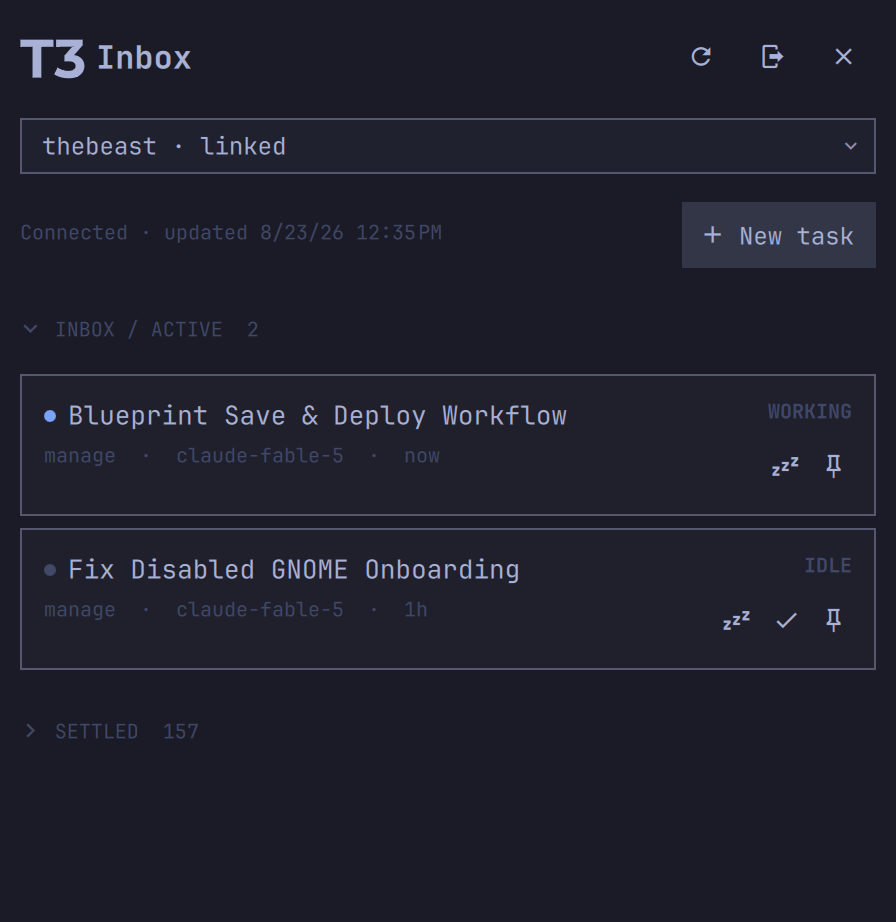

# Omarchy T3 Code Mini

A compact native Omarchy/Quickshell client for the T3 Code Inbox. It runs a
typed TypeScript bridge as a child of the shell; QML owns presentation only.
There is no embedded browser, web UI, terminal, editor, file tree, or Git UI.



The supported and compatibility-tested revision is T3 Code Nightly
`v0.0.34-nightly.20260822.1160` at
`2c4158f87a1b6a586d0aa5e0338f122cb7887c4f`. The exact source is the
`upstream/t3code` submodule and is recorded in `t3-upstream.lock.json`.

## Current interoperability status

The client and plugin are implemented, built, packaged, and tested. The
default browser flow creates a native Clerk client session and requests T3's
official `t3-relay` JWT template before entering the pinned ManagedRelay/DPoP
runtime. This is the credential type accepted by the currently deployed Relay.
The browser callback is handed from T3's allow-listed packaged scheme to a
loopback-only listener, then `auth.completed` automatically summons Inbox.

This path was validated against the working DigitalPals Quickshell module at
commit `6aa074432f36548381ead91ed39d57c34529e327`; see [UPSTREAM.md](UPSTREAM.md).
The old CLI OAuth provider remains only as source-tested compatibility code:
the deployed Relay still rejects that token type at its DPoP exchange, while
the native Clerk session avoids that restriction without pairing or session
scraping. A real-account run on 2026-08-23 confirmed browser sign-in, automatic
panel return, Relay/DPoP authorization, environment Effect RPC, Inbox loading,
and reconnection after an Omarchy Shell restart. Thread mutations remain on the
manual acceptance checklist; no production credential is used in CI or this
repository.

## Features

- T3 Connect native Clerk browser authentication with the official Relay JWT
  template, a secret-authenticated loopback callback handoff, automatic panel
  return, restart persistence, and logout.
- T3 Connect environment discovery, selection, remembered preference, and
  reconnect with bounded exponential backoff.
- Nightly Inbox semantics for pinned, active, snoozed, and settled threads,
  including Working, Ready, Input, Approval, and failure attention state.
- Chat-first streamed thread detail with Markdown, per-turn changed-file trees,
  approvals, and multi-question user input.
- New tasks and follow-ups, queue/steer-compatible turn dispatch, screenshot
  paste with removable previews, Stop, provider/model selection,
  model-advertised reasoning and service-tier controls, and runtime access
  mode.
- Settle/unsettle, snooze/wake, pin/unpin, rename, and capability-gated title
  regeneration using server-side T3 orchestration commands.
- Versioned, validated stdin/stdout NDJSON between QML and the bridge. Raw T3
  objects and credentials never cross into QML.
- A self-contained Linux executable for runtime installation; Node and pnpm
  are build-time requirements only.

## Known v1 limits

- The public CLI OAuth credential remains incompatible with the deployed
  Relay's DPoP exchange. The production provider uses a native Clerk session
  instead; CLI OAuth is not an automatic fallback.
- The standalone bridge cannot embed T3's Electron-only Clerk SDK. Its small
  native request adapter is pinned to the Clerk API/SDK metadata used by the
  supported Nightly and is covered by compatibility tests; an upstream
  non-Electron native SDK would be cleaner.
- Thread detail requests the official runtime's initial paginated window (ten
  user turns). Loading older pages is not exposed in the compact UI yet.
- The compact composer accepts screenshots from the Wayland clipboard; a
  graphical file picker, graphical slash-command picker, and drag-to-reorder
  pinned threads remain deferred nice-to-have features.
- Automatic settlement uses the pinned runtime's default age and merge
  semantics. Client-local overrides from another official client are not part
  of the remote shell projection, so this mini client cannot mirror such a
  local customization. Explicit settle/unsettle remains server authoritative.

## Requirements

Runtime:

- An x86-64 Linux installation of Omarchy 4.0 or newer with its current
  Quickshell plugin system and
  `wl-paste` (provided by Omarchy's standard `wl-clipboard` installation).
- A freedesktop Secret Service implementation and `secret-tool` (present in a
  standard Omarchy install).
- `xdg-open`, `xdg-mime`, `gzip`, `sha256sum`, and a graphical browser.

The marketplace checkout includes a checksum-verified compressed x86-64
bridge. It expands into `lib/.runtime/` inside that checkout on first launch;
it does not download or execute a mutable remote installer. Other Linux
architectures can build a native release artifact from source.

Development and packaging:

- Git with submodule support.
- Node.js 24.13.1 or newer.
- pnpm 11.10.0.

## Security and system footprint

Like every Omarchy plugin, this code runs unsandboxed with the current user's
permissions inside the long-lived shell. It never invokes `sudo` or `pkexec`,
does not install or control a systemd service, and does not overwrite shell,
Hyprland, or terminal configuration. Marketplace validation is a compatibility
and listing check, not a security review or warranty.

The plugin starts one child bridge and connects to T3 Connect/Clerk, T3 Relay,
and the T3 environment selected by the signed-in account. It stores the native
Clerk client token, pending callback secret, and DPoP private material in
Secret Service, plus the selected environment under the user's XDG state
directory. Choosing **Sign in with T3 Connect** explicitly creates a hidden
desktop callback entry and temporarily claims `t3code://`; both the entry and
the prior scheme-owner change are reversed when that login window closes.
Installation requires no privilege escalation and runs no remote build.

The root [LICENSE](LICENSE), [THIRD_PARTY_NOTICES.md](THIRD_PARTY_NOTICES.md),
and [licenses](licenses/) inventory cover the plugin, embedded Node runtime,
pinned T3 code, and bundled dependencies. See [SECURITY.md](SECURITY.md) for
the complete trust boundaries and private reporting channel.

## Build from a clean checkout

```bash
git clone https://github.com/DigitalPals/omarchy-t3code.git
cd omarchy-t3code
git submodule update --init upstream/t3code
pnpm install --frozen-lockfile
pnpm check
pnpm package
```

Initialize only the top-level `upstream/t3code` submodule. The pinned T3 tree
contains an unrelated internal gitlink without `.gitmodules` metadata, so a
recursive submodule command fails inside upstream even though this project's
required checkout is complete.

`pnpm package` builds and self-tests a Node single-executable application,
then writes an installable plugin to `dist/plugin` and a tar archive to
`dist/omarchy-t3code-plugin.tar.gz`.

## Install

Install directly through Omarchy's standard plugin flow:

```bash
omarchy plugin add https://github.com/DigitalPals/omarchy-t3code.git --enable
```

Omarchy shows its unsandboxed-code warning, clones this repository, validates
the root manifest and entry points, and enables the plugin. No Node, pnpm, Bun,
separate daemon, download hook, or administrator access is needed. Update the
Git-managed installation with:

```bash
omarchy plugin update io.github.digitalpals.omarchy-t3code
```

Alternatively, use a prebuilt release artifact:

```bash
tar -xzf omarchy-t3code-plugin.tar.gz
./install
```

Release automation currently publishes a `linux-x64` archive. It is
architecture-specific and must run on an x86-64 Omarchy machine. Other Linux
architectures can build an archive for their current CPU from source. Verify a
download first with `sha256sum -c omarchy-t3code-plugin.tar.gz.sha256`.

From a source checkout on Omarchy:

```bash
pnpm install:plugin
```

The source installer packages for the current CPU, atomically places the
plugin at
`~/.config/omarchy/plugins/io.github.digitalpals.omarchy-t3code`, rescans the
running shell, enables the plugin, and puts its widget at the left edge of the
right bar section on first install. Updates preserve the widget's current bar
position. The installer migrates the earlier
`io.github.omarchy-t3code` development ID. It retains only the immediately
previous installation under the registry-ignored `.backups/` directory, so
repeated updates do not accumulate copies of the standalone runtime.

If Omarchy is not running, restart it and then run:

```bash
omarchy bar put io.github.digitalpals.omarchy-t3code --section right --index 0
```

Click the T3 mark in the bar to open its anchored Omarchy modal, then choose
**Sign in with T3 Connect**. The browser callback automatically reopens the
modal at Inbox. Right-clicking the bar icon refreshes environments.

## Uninstall

For a complete marketplace uninstall, including plugin-owned state, temporary
callback registration, and Secret Service items, run:

```bash
~/.config/omarchy/plugins/io.github.digitalpals.omarchy-t3code/uninstall
```

Add `--keep-secrets` only when deliberately retaining the Clerk session and
DPoP identity for a later reinstall. Omarchy's generic `plugin remove` command
also removes the checkout and expanded runtime, but intentionally does not know
about plugin-owned Secret Service or XDG state, so the bundled uninstaller is
the complete removal path.

The release archive includes the same uninstaller beside `install`:

```bash
./uninstall
```

From a source checkout, run `pnpm uninstall:plugin`. Uninstall removes the
current and legacy plugin directories, retained backup, callback registration,
selected-environment state, and plugin-owned Secret Service items. To keep the
Clerk session and DPoP identity for a later reinstall, use
`./uninstall --keep-secrets` (or `pnpm uninstall:plugin -- --keep-secrets`).

## Development

Useful commands:

```bash
pnpm typecheck
pnpm test
pnpm test:compat
pnpm validate:repo
pnpm check:qml
pnpm build
pnpm check:t3-nightly
```

The development bridge is `bridge/dist/t3-mini-bridge.mjs`. It reads one
protocol-v1 request per stdin line and emits responses/events on stdout. Use
`bridge.ping` and `bridge.shutdown` for process-level diagnostics; do not send
credentials over this protocol.

The full real-account procedure is in [docs/ACCEPTANCE.md](docs/ACCEPTANCE.md).

## Troubleshooting

- **Browser returns to the wrong T3 application:** retry from the panel and
  verify `xdg-mime` can update the user's MIME associations. The bridge creates
  its hidden desktop entry only for the active login window and restores any
  previous `t3code` handler afterward.
- **Secret store unavailable:** verify `secret-tool lookup application
  io.github.digitalpals.omarchy-t3code item t3-connect-clerk-client >/dev/null` can reach
  an unlocked Secret Service. Do not print its value or replace it with a
  plaintext file.
- **Relay session is rejected:** sign out and sign in again so the bridge can
  mint a fresh `t3-relay` template JWT. A message specifically mentioning CLI
  OAuth means an old bridge/provider is still installed.
- **Plugin does not load:** run `omarchy plugin validate
  ~/.config/omarchy/plugins/io.github.digitalpals.omarchy-t3code`, followed by `omarchy
  shell shell rescanPlugins`.
- **Bridge restarts repeatedly:** run the installed
  `bin/t3-mini-bridge --self-test`. It should print JSON containing the pinned
  commit and also verifies/expands the marketplace runtime when necessary.

## Project documentation

- [ARCHITECTURE.md](ARCHITECTURE.md) — components, IPC, state, and packaging.
- [UPSTREAM.md](UPSTREAM.md) — Nightly audit, source reuse, authentication
  selection, and update workflow.
- [SECURITY.md](SECURITY.md) — credentials, DPoP, local IPC, and trust boundaries.
- [AGENTS.md](AGENTS.md) — invariants for future coding agents.
- [CONTRIBUTING.md](CONTRIBUTING.md) — development and review requirements.
- [CHANGELOG.md](CHANGELOG.md) — user-visible release history.
- [RELEASING.md](RELEASING.md) — publication and pin-review checklist.
